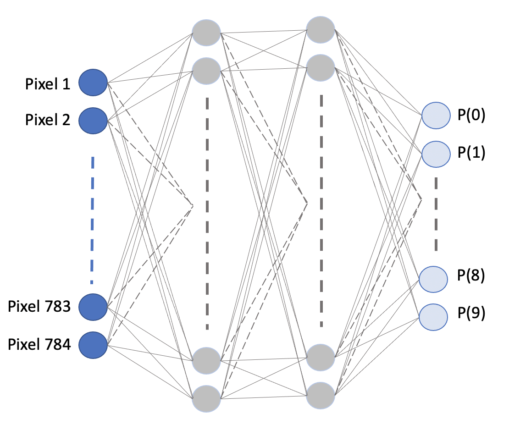
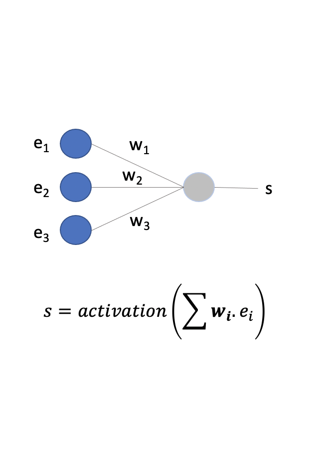
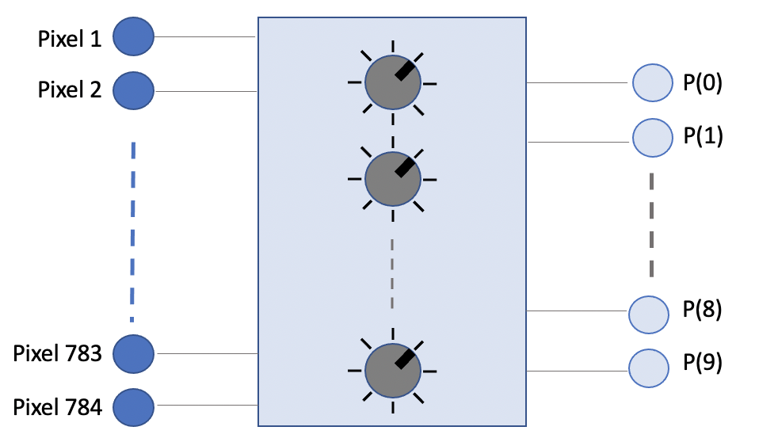

Introduction à l'apprentissage numérique
=====================================

Les nombreuses appliccations de l'intelligence artificielle sont souvent possibles grâce à des réseaux de neurones artificiels. L'une des premières utilisations des réseaux de neurones consistait à reconnaître les chiffres écrits à la main sur les enveloppes pour automatiser le tri postal. 

Réseau de neurone |  Un neurone
:-------------------------:|:-------------------------:
 | 

!!! note ""
	**Figure 1:** Visualisation d'un réseau de neurones pour reconnaitre des chiffres. 

L'image du chiffre est décomposée en 28 x 28 = 784 pixels en niveaux de gris. Chaque pixel est représenté sur 8 bits (valeurs allant de 0 à 255 inclus). Ces 784 valeurs sont données comme **entrée** du réseau de neurones. Des calculs composés de successions de sommes pondérées et de fonction non-linéaires (ou fonction d'activation) telles que des [sigmoides](https://fr.wikipedia.org/wiki/Sigmo%C3%AFde_(math%C3%A9matiques)) sont appliqués à ces 784 valeurs afin d'obtenir dix nombres en **sortie**. 

L'objectif est que ces dix nombres en sortie représentent la probabilité qu'une image corresponde au chiffre 0, 1, 2, etc... jusqu'au chiffre 9. Cependant cela ne sera le cas que pour certaines valeurs de poids $w$ utilisés dans les sommes pondérées. Faire apprendre le réseau de neurone consistera à ajuster ces poids pour que l'objectif soit atteint. Les détails mathématiques du réseau de neurones mis de côté, son apprentissage peut être considéré comme l'ajustement de paramètres pour satisfaire un objectif.

!!! note ""
	**Figure 2:** L'apprentissage consiste à modifier les paramètres de façon à ce que la sortie corresponde à ce que nous désirons. On met un *4* en entrée et on change les paramètres jusqu'à ce que la probabilité *P(4)* soit supérieure aux autres, etc... 

En partant d'un problème de robotique, cette séquence permettra de découvrir le mécanisme qui permet d'ajuster ces paramètres de manière automatique, c'est-à-dire de créer un apprentissage de façon numérique.

(Pré-requis) Pour suivre cette séquence, vous aurez besoin de savoir manipuler des listes dans un langage visuel ou texte (makecode ou python). 

