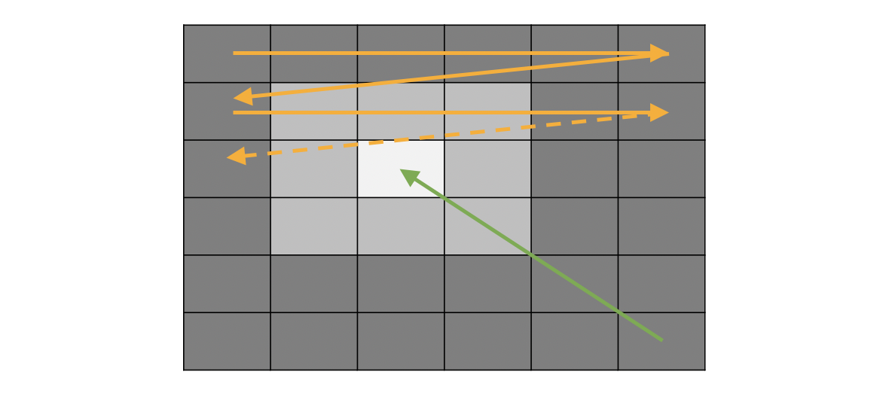

# Recherche en grille

A partir de la mesure de luminosité des capteurs, l'objectif est maintenant de contrôler les moteurs du robot pour, que comme le tournesol, il se tourne vers le soleil. En d'autres termes, l'objectif est de **maximiser la lumière captée par les capteurs**. 

Pour se faire, nous allons voir deux stratégies: la recherche en grille et la descente de gradient. Pour prendre le temps de se familiariser avec chacune, nous résolverons d'abord le problème en 1 dimension (recherche horizontale seulement) pour ensuite résoudre le problème en 2 dimensions.

La recherche en grille consiste à découper notre espace de recherche de manière régulière, de prendre une mesure de la quantité de lumière captée pour chaque emplacement et de mémoriser le paramétrage des angles qui maximise cette quantité.

## Recherche sur 1 dimension

Considérons la position verticale de la tête du robot comme fixe. Nous allons donc d'abord chercher quel angle horizontal maximise la quantité de lumière globale mesurée.

   
!!! note ""
	**Figure 6:** Un programme qui permet de déplacer la tête du robot de droite à gauche.

!!! note "Exercice 3"
	En s'appuyant sur la fonction définie dans l'exercice 2 et le programme précédent, écrire un programme qui:

	1. fait se déplacer la tête du robot de l'extrême droite à l'extrême gauche tout en mesurant la quantité de lumière captée.
	2. fait revenir la tête du robot la où la quantité de lumière est maximale.

!!! note "Exercice 4"
	- Modifier votre programme pour que la recherche se fasse plus rapidement. On pourra pour cela récupérer moins d'échantillons dans le même espace. Remarquez que plus on voudra un résultat rapide, moins le résultat sera précis.
	- Si le robot est programmer pour prendre *n* échantillons par axe et que le temps nécessaire pour prendre chaque échantillon est *t*, combien de temps va prendre la recherche ? À combien de temps cela correspond pour *n = 100* et *t = 1s* ?

## Recherche sur 2 dimension

Le problème étant résolu en 1 dimension, nous pouvons maintenant complexifier le problème à résoudre et le faire sur deux dimensions.

!!! note ""
	**Figure 7:** Le robot parcourt tout l'espace horizontal et vertical à la recherche de la quantité de lumière maximale pour s'orienter finalement vers la position correspondante.

!!! note "Exercice 5"
	- Modifier votre programme pour que la recherche se fasse horizontalemement et verticalement comme l'illustre la figure précédente et que la tête du robot se tourne vers la lumière.
	- Si le robot est programmer pour prendre *n* échantillons par axe et que le temps nécessaire pour prendre chaque échantillon est *t*, combien de temps va prendre la recherche en deux dimensions ? À combien de temps cela correspond pour *n = 100* et *t = 1s* ?
	- Si le robot était pourvu de roues qui lui permettaient de se déplacer dans l'espace selon les directions nord/sud et est/ouest et que nous prenions le même nombre d'échantillons sur ces axes, quel deviendrait ce temps ? À combien de temps cela correspond pour *n = 100* et *t = 1s* ?

