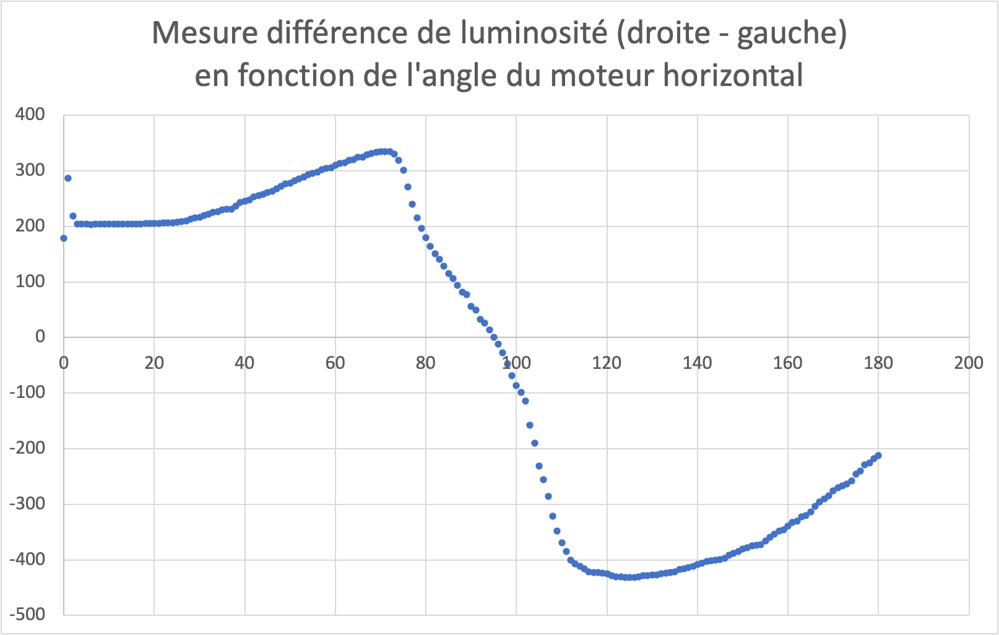

# Descente de gradient

Alors que la recherche en grille est un outil d'optimisation très répandu, elle a une faiblesse: son temps d'execution devient colossal lorsque le nombre d'axes de l'espace de recherche augmente. Cette section vous permettra de découvrir une méthode d'optimisation classique pour dépasser ce problème appelée la descente de gradient ainsi que des lois de contrôle robotique standards.

## Recherche sur 1 dimension - loi de contrôle on/off

Mettons nous à la place du robot pendant un moment. Considérons pour l'instant seulement ces deux capteurs supérieurs. Pour imaginer l'information à disposition du robot, on pourrait imaginer que chacun de ses capteurs comme l'un de nos yeux. Cependant comme nos yeux voient beaucoup plus qu'une seul information de luminosité mais une image complète, mettons nous à sa place en enfillant des lunettes avec une correction si forte qu'il ne reste qu'un grand flou.

Comment dans ces conditions tourner mon coup à gauche ou à droite pour trouver où se situe le soleil ? Je pourrais, comme dans la recherche en grille tourner mon tête de gauche à droite pour trouver là où la lumière moyenne est maximale, mais je pourrais également suivre l'algorithme suivant:

- Si la quantité de lumière à gauche est supérieure à celle perçue à droite, alors tourner vers la gauche.
- Si la quantité de lumière à droite est supérieure à celle perçue à gauche, alors tourner vers la droite.

et répéter cela indéfiniment. 

!!! note "Exercice 6"
	- En utilisant les capteurs supérieur du robot et l'algorithme précédent, programmer le robot pour qu'il se tourne vers la lumière.
	- Le robot fait probablement des vas et viens autour de la position finale, changer le programme pour que le robot se tourne vers la lumière et s'arrête.

## Recherche sur 1 dimension - contrôle proportionnel

L'algorithme précédent est facile à comprendre, facile à programmer, mais il a une limite: arrivé à convergence (à l'objectif) il fera tourner le robot à la même vitesse que lorsque le robot est loin de cet objectif. On peut définir un seuil de différence pour lequel le robot ne se déplacera plus, cependant si l'on définit notre algorithme ainsi alors il perdra en précision.

Pour dépasser ce problème et définir un nouvel algorithme, appelons *diff* la différence entre la mesure de lumière de droite et de gauche, et remarquons que: 

- quand le robot est tourné vers la source de lumière principale, *diff* est nulle,
- quand *diff* est supérieure à zéro, il y a plus de lumière à droite, donc le moteur doit tourner vers la droite, ce qui correspond à faire diminuer l'angle du moteur,
- quand *diff* est inférieure à zéro, il y a plus de lumière à gauche, donc le moteur doit tourner vers la gauche, ce qui correspond à faire augmenter l'angle du moteur.

<!-- Just one possible MathJax CDN below. You may use others. -->

Ainsi, alors que dans la section précédente la mise à jour de l'angle se faisant en utilisant la formule: $angle_t = angle_{t-1} + signe(diff)$, voyons ce qui va se passer si la formule devient: $angle_t = angle_{t-1} + \lambda diff$. On peut déjà remarquer que cela pourra avoir l'avantage de ne pas avoir le phénomène de vas et viens à convergence car *diff* est nulle à cet endroit.

Pour prédire ce qui va se passer, prenons d'abord $\lambda = 1$ et visualisons les valeurs de *diff* en fonction de l'angle du moteur horizontal. Ceci peut être fait grâce à un programme similaire à celui utilisé dans la recherche en grille, à la différence que pour chaque angle la mesure de différence sera envoyé au port série grâce à l'instruction *serial_write_number(diff)*, et que nous utiliserons l'outils console de makecode qui permet d'exporter les nombres reçus sur un tableur au format *csv*.

!!! note ""
	**Figure 8:** Mesure de *diff* en fonction de l'angle du moteur horizontal.

!!! note "Exercice 7"
	- Visualiser les valeurs de *diff* en fonction de l'angle du moteur horizontal dans votre environnement. Comme les mesures de la lumière dépend de l'environnement, vos mesures seront forcément différentes de celle présentées ci-dessus.
	- Pour $\lambda = 1$, que se passera-t-il si votre robot est à 10 degrés de l'objectif en applicant la formule $angle_t = angle_{t-1} + \lambda diff$ ? Comme nous voulons que le robot arrive progressivement à l'objectif, comment va-t-il falloir régler $\lambda$ ?
	- Programmer cette nouvelle loi de contrôle, tester votre paramétrage de $\lambda$ et vérifier que le mouvement du robot se fait de manière fluide jusqu'à l'objectif. 

## Recherche sur 2 dimension

!!! note "Exercice 8"
	En appliquant la même stratégie pour le contrôle de l'axe vertical, écrire un programme qui permet de faire s'orienter le robot vers la lumière selon les deux axes en même temps. 

## Avantages et limites

Comme on peut le remarquer, la descente de gradient a plus de rapidité et de précision que la recherche en grille. Ces deux qualités sont souvent recherchées dans les applications de robotique. Cependant cette dernière stratégie a aussi des défauts: imaginez par exemple qu'il y a deux sources de lumières, un soleil et un projecteur, qui éclairent le robot depuis deux directions différentes. On se retrouvera avec des mesures similaires à celles présentées dans la figures suivante:

!!! note ""
	**Figure 9:** Mesure de luminance et de *diff* en fonction de l'angle du moteur horizontal si un projecteur éclaire le robot avec un angle de 50° et que le soleil l'écaire avec un angle de 120°.

Dans ce cas, en suivant la stratégie appelée ici de descente de gradient, alors si le robot démarre en étant tourné plus face au projecteur qu'au soleil, alors il se tournera finalement vers le projecteur. Il est attiré par ce que l'on appelle un maximum local (celui créé par le projecteur), et non global (celui du soleil).

