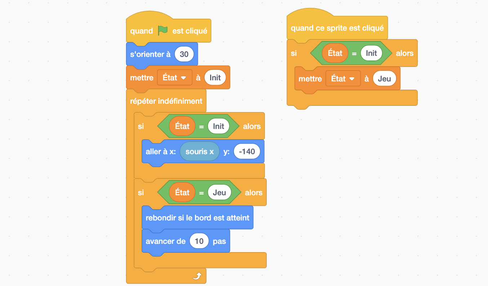

## Balle

!!! note ""
	**Figure 3:** Objectif final: La balle suit la raquette. Quand je clique sur la raquette la balle est lancée et rebondit sur les murs et la raquette. Si la balle touche le bas de la scène, le fond est changé pour montrer "Game Over" et tout s'arrête. 

Lorsque le jeu commence la balle doit rester sur la raquette. Quel programme donner à la balle ? Jusqu'à maintenant rien de nouveau. On peut écrire le même programme que celui de la raquette, à la différence de la valeur *y* du bloc *aller à ...*. En effet puisque la raquette suit la souris, pour que la balle suive la raquette on peut simplement la programmer à suivre la souris.

Le problème est plus intéressant lorsqu'on ajoute maintenant pour objectif que la balle doit être lancée quand la raquette est cliquée. Et attention: la balle n'est lancée que si elle était sur la raquette !

### Deux états

Décomposons le problème: d'abord voyons comment programmer la balle pour qu'elle se déplace, puis comment gérer la transition de la balle qui suit la raquette, à la balle qui se déplace sur la scène après son lancement.

!!! note "Exercice 4"
	Écrire un programme pour que la balle se déplace suivant une ligne droite dans la scène et qu'elle rebondisse sur les bords. Pour cela vous aurez bien sûr besoin de l'événement *drapeau*, auquel vous pourrez ajouter un bloc *contrôle* et deux blocs de type *mouvement*.

??? note "Solution exercice 4"
    

Nous avons à présent défini deux programmes: l'un qui nous permet d'avoir la balle qui suit la raquette (ou en vrai la souris) et l'autre qui permet d'avoir la balle en mouvement dans notre scène.

!!! Question 1
	Puisque la balle doit d'abord suivre la raquette puis se déplacer sur la scène et rebondir, puis-je simplement combiner mes deux programmes ?

??? note "Réponse"
	
	La réponse est non: 1. Si je mets une boucle infinie suivie d'une autre boucle infinie, la deuxième sera ignorée car le programme restera dans la première. C'est pour cela qu'il n'est pas possible d'imbriquer de bloc à la suite d'une boucle infinie dans Scratch comme le montre la figure ci-dessus; 2. Si j'avais mis mes deux programmes ensemble, les deux s'exécuteraient en même temps quand le drapeau est cliqué et la boucle de suivi de souris l'emporterait sur l'autre ce qui ne résoudrait pas notre problème.

Pour résoudre notre problème, il nous manque  deux éléments primordiaux à beaucoup d'algorithmes et de programmes: 

 - les **variables**: elles jouent souvent le rôle de mémoire. Par exemple dans notre jeu, nous ne souhaitons pas seulement que mon programme fasse quelque chose quand la raquette a été cliquée, nous voulons aussi pouvoir nous souvenir que cela est arrivé. Pour cela nous allons définir une variable nommée *État*, qui sera initialisée à "Init" au début du programme et que l'on modifiera à "Jeu" quand la raquette sera cliquée. Comme on peut le voir dans cet exemple, une variable a un nom et elle contient une information qui peut être modifiée et lue.
 - les **conditions**: il va falloir que notre balle suive la raquette **si** la variable *État* a pour valeur "Init" et qu'elle se déplace en rebondissant **si** *État* a pour valeur "Jeu". On appelle cela des instructions conditionnelles: ce sont des instructions qui ne seront réalisées que si une condition que l'on a définie est vraie. Dans un test on a donc au moins deux éléments essentiels: une question/condition qui ne peut être répondue que par "oui" ou "non" (on parlera de booléen dans le milieu de l'informatique) et les instructions à réaliser si la réponse est "oui".

!!! note "Exercice 5"
	Écrire un programme pour que la balle suive la raquette au début du programme, puis, après un clic sur la raquette, qu'elle se déplace diagonalement dans la scène et rebondisse. Pour cela vous aurez besoin des blocs de type *variables*, *contrôle* et *opérateurs*. Remarquez les différentes formes de blocs. Dans le bloc "si alors" on ne peut qu'imbriquer des blocs losanges après le si. Pourquoi ? Parce qu'après le "si", comme on l'a vu précédement, on ne peut avoir qu'une expression qui retourne "oui" ou "non", et c'est ce que font ces blocs losange. Vous trouverez des blocs de ce type dans les *Opérateurs*.

??? note "Solution exercice 5"
    
    Dans le bloc losange " ... = ... " on a imbriqué le bloc variable *État* d'un côté et tapé la valeur "Init" ou "Jeu" de l'autre côté. Encore une fois on peut remarquer la forme spéciale de ces blocs qui est cette fois-ci arrondie. Ces blocs arrondis correspondent à des informations qui peuvent être de différents types (texte ou nombres). Dans ce cas le bloc arrondi "État" renvoie la valeur qui est mémorisée dans la variable. Ainsi, si je devais traduire la première condition qui apparaît dans ce programme en français, je le traduirais comme "Si la variable État a pour valeur Init alors...". Remarquez également qu'un bloc "s'orienter à 30°" a été ajouté pour que la balle se déplace en diagonale.

### Trois états

Il ne manque maintenant plus qu'à faire rebondir la balle sur la raquette, et à arrêter le jeu lorsque la balle touche le bas de la scène. Pour cela nous allons découvrir les blocs de type "capteurs". En robotique, il est possible d'équiper les robots de capteurs pour qu'ils puissent percevoir des informations de leur environnement. Dans scratch, nos sprites aussi sont équipés de capteurs. Ainsi un sprite pourra savoir sa position dans l'espace, savoir quand il est touché par un autre sprite et bien d'autres informations.

!!! note "Exercice 6"
	Modifier le programme de la balle en utilisant ses capteurs pour que celle-ci rebondisse sur la raquette et pour afficher Game Over et que tout s'arrête quand la raquette manque la balle. Pour cela vous mettrez la valeur "Over" dans la variable *État*.

??? note "Solution exercice 6"
    
    Remarquez ici l'utilisation du bloc "GestionDéplacement". Vous n'avez normalement pas ce bloc. Pourquoi ? Parce que c'est un bloc que j'ai créé moi même et que je vous invite à créer également grâce aux types de blocs "Mes Blocs". Dans cette catégorie vous trouverez un bouton "Créer un bloc" qui vous permettra de créer un bloc du nom que vous souhaitez.  Pour quoi faire? Parce que ça me permet de faire tenir mon programme dans un imprim-écran, mais pas seulement ! Créer un bloc en scratch, correspond en informatique à la création d'une **procédure**. Dans le programme ci-dessus à droite vous pouvez voir la définition de la fonction "GestionDéplacement", qui définit ce qui sera exécuté quand la fonction sera appellée. A gauche la fonction est appellée. Les **procédures** sont utiles pour résoudre un problème en le décomposant, ce qui est primordial en pensée informatique. Dans le cas présent, j'ai voulu résoudre mon problème de gestion du déplacement et j'ai donc créé la fonction pour le résoudre. Un autre avantage est que si j'ai un problème avec mon déplacement au moment de l'exécution de mon programme, je sais maintenant exactement où regarder.
     
Si vous avez réussi à résoudre l'exercice précédent sans regarder la solution je vous en félicite. Je vous invite cependant à regarder tout de même la solution pour découvrir l'usage des **procédures** qui est le dernier élément essentiel à la plupart des programmes informatiques.

