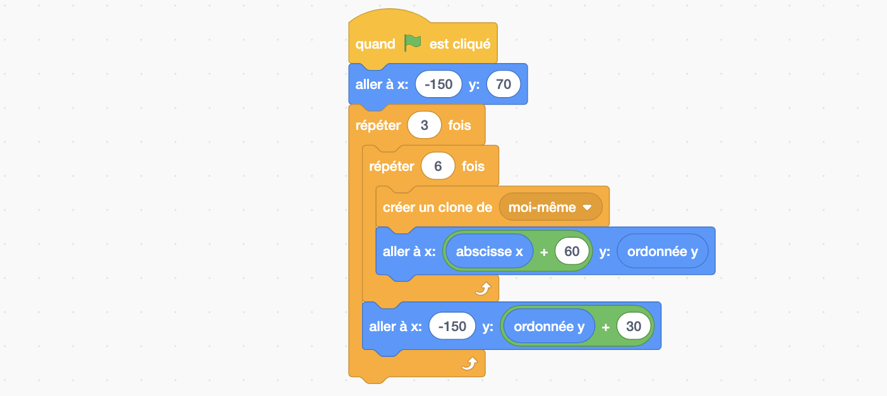

## Briques

!!! note ""
	**Figure 4:** Objectif final: le jeu casse briques !

Nous voilà presque à la fin de notre programme. Dans cette dernière partie nous allons découvrir l'utilisation des boucles classiques (c'est-à-dire pas infinies), et une particularité vraiment sympa de scratch qui est la création de clones. Vous verrez que le programme est très court mais qu'il demande un exercice de pensée un peu particulier...

!!! note "Exercice 7"
	Créer un nouveau sprite nommé "Brique". En utilisant entre autres une boucle "Répéter ... fois", l'instruction Contrôle "créer un clone de moi-même" et l'instruction "aller à x:...,y:...", créer un mur de 6 briques de large et d'une brique de haut quand le drapeau est appuyé.

??? note "Solution exercice 7"
    
    Si vous n'avez pas résolu le problème sans regarder, prenez un morceau de papier et essayez de simuler le programme ci-dessus. Après l'exécution de ce programme, combien de briques y à t'il ?
    

!!! note "Exercice 8"
	Modifier maintenant votre programme pour que votre mur soit toujours créé à la même place et qu'il soit de 3 briques de haut. Utilisez pour cela une **boucle imbriquée**, c'est-à-dire une boucle dans une boucle.

??? note "Solution exercice 8"
    
    
!!! note "Exercice 9"
	Enfin modifiez votre programme pour que la balle casse les briques tout en rebondissant dessus. 

??? note "Solution exercice 9"
    
    Dans la solution que je propose ici, j'ai utilisé la fonction "Envoyer à tous *rebond*". J'ai aussi ajouté un bloc "quand je reçois Rebond" dans le programme de ma balle que je ne montre pas ici. J'aurais pu ajouter une condition "si touche brique" dans le programme de ma balle, cependant, puisque le programme de la balle et celui de ma brique tournent en parallèle, si j'avais choisi cette deuxième option, alors il serait probable que le clone de ma brique soit supprimé avant que ma condition de balle soit testée. Ainsi il serait possible que ma balle ne rebondisse pas à chaque fois contre les briques.
    Comme mes explications commencent à être longue je les arrête là et je vous invite à prendre le temps de bien lire ce programme afin de comprendre pourquoi j'ai utilisé les instructions "cacher" et "montrer" comme je l'ai fait.

