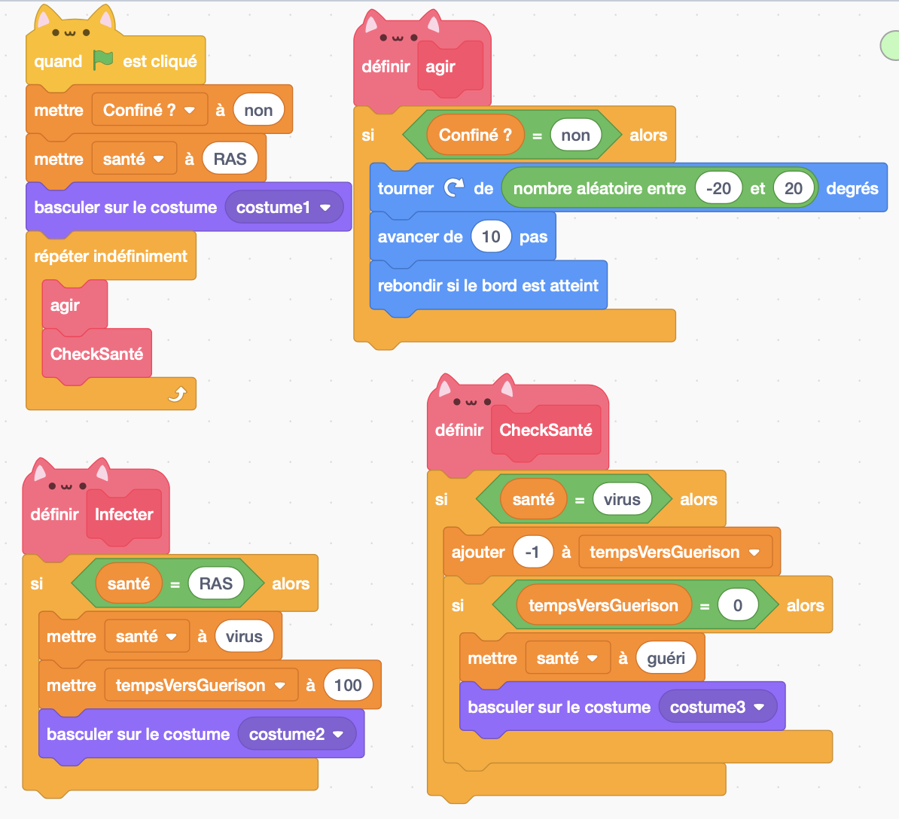

## Modéliser un individu

!!! note ""
	**Figure 1:** Un individu se déplace dans un environnement 3D fini.

Comme le virus n'en a que faire de l'apparence des individus, nous non plus. Alors commençons par créer un individu que nous représentons sous forme d'une balle. Créez donc un nouveau projet, enlever le sprite par défaut, ajouter un nouveau sprite défini par un simple cercle vert et renommer le "Humain".

!!! note "Exercice 1"
	Programmez l'humain pour qu'il se déplace de manière aléatoire dans l'espace pour toujours quand on clique sur le drapeau. Attention: on ne veut pas que l'humain se retrouve coincé sur les bords...

!!! note "Exercice 2"
	Ajouter une variable propre à l'humain qui définit si il est confiné ou pas. Faites varier son comportement en fonction de cette variable. S'il est confiné il ne bouge pas, s'il l'est il se déplace aléatoirement. **Attention : quand vous créez une nouvelle variable, vous avez le choix de la partager ou non avec les autres sprites. Plus tard, dans notre cas, nous souhaiterons avoir certains humains confinés, d'autres non. On voit donc que notre variable décrivant cette caractéristique ne doit pas être partagée !**

??? note "Solution exercice 1 et 2"
    
    La solution proposée ici n'est qu'une proposition. Comme souvent en informatique il y a bien des solutions aussi valables les unes que les autres. Je vous laisse juger la validité de la votre.

!!! note "Exercice 3"
	Ajouter une variable à l'humain pour indiquer s'il est sain, infecté ou guéri. Ajouter une fonction pour l'infecter. Puis ajouter une variable qui permet de savoir à combien de jours de la guérison il est et une fonction qui sera appelée à chaque instant de la boucle principale pour vérifier son état de santé et le mettre à jour. Chaque fois que cette fonction est appelée, si la personne est contaminée, le nombre de jours diminue de 1. Si ce nombre arrive à 0 alors la personne est guérie. Faites varier l'apparence du sprite en fonction de son état de santé.

??? note "Solution exercice 3"
    
    Remarquez ici que pour faire varier l'apparence du sprite, j'ai choisi de choisir l'instruction "basculer de costume" plutôt "mettre l'effet ...". Sans pouvoir vous en dire plus, je vous conseille d'en faire autant pour faciliter le travail à venir.

