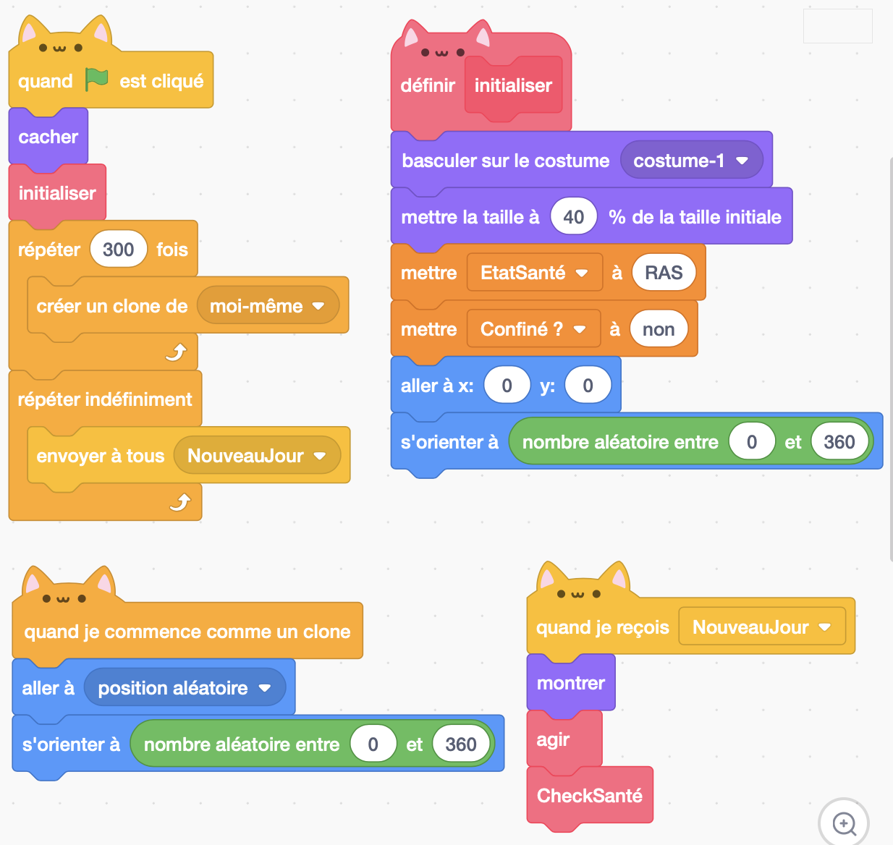

## Peupler l'environnement

!!! note ""
	**Figure 2:** Une multitude d'individus se déplace dans un environnement 3D fini.

Pour l'instant nous avons modélisé un individu. Notre objectif va être maintenant d'avoir un grand nombre d'individu pour modéliser notre société. Nous utiliserons pour cela l'instruction "créer un clone de moi-même" et l'évenement "quand je commence comme un clone" qui vous permettrons de faire une copie de votre individu et de ses propriétés.

!!! note "Exercice 4"
	Tester ces deux nouvelles briques et utilisez-les pour peupler votre monde virtuel de 300 individus.

??? note "Solution exercice 4"
    
    Remarquez ici que j'ai utiliser l'instruction "cacher" puis "montrer". C'est une petite astuce en Scratch pour permettre aux clones d'être créé plus rapidement. Vous pourriez aussi créer une fonction dédiée à l'initialisation de la scène et créer le bloc correspondant en sélectionnant l'option "Exécuter sans rafraîchissement d'écran".

